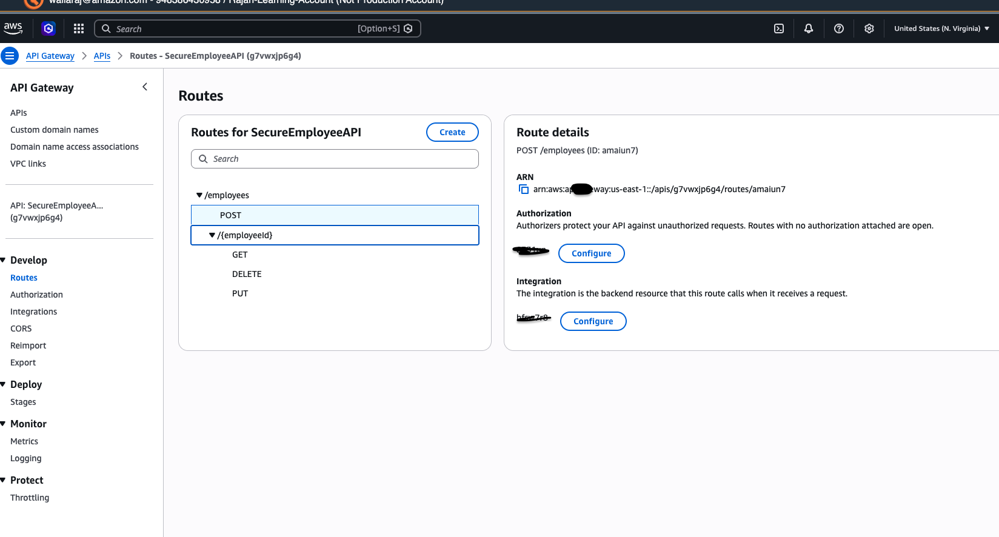
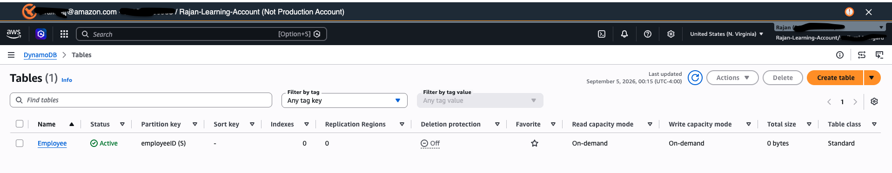
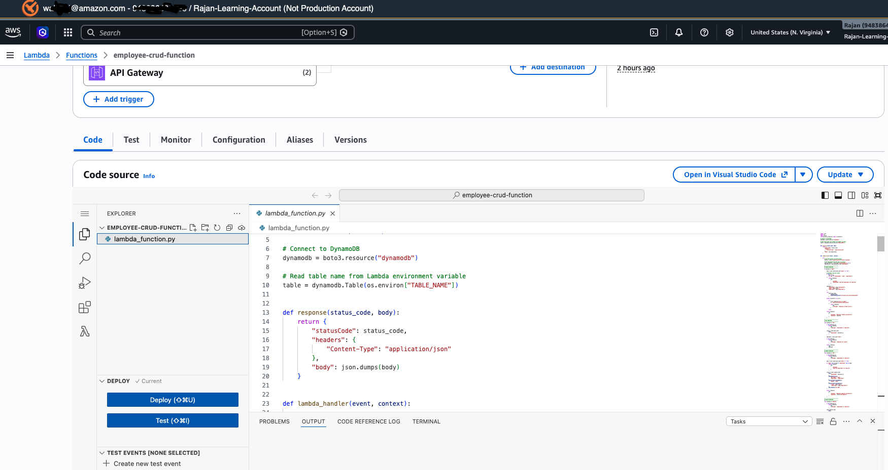
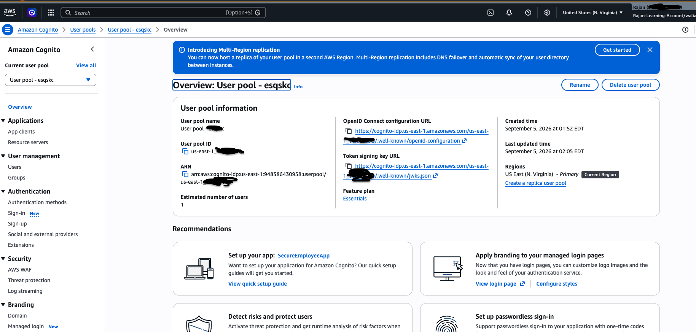
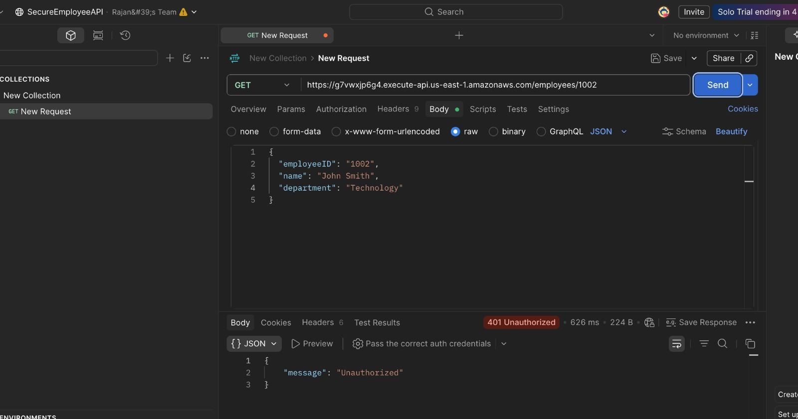
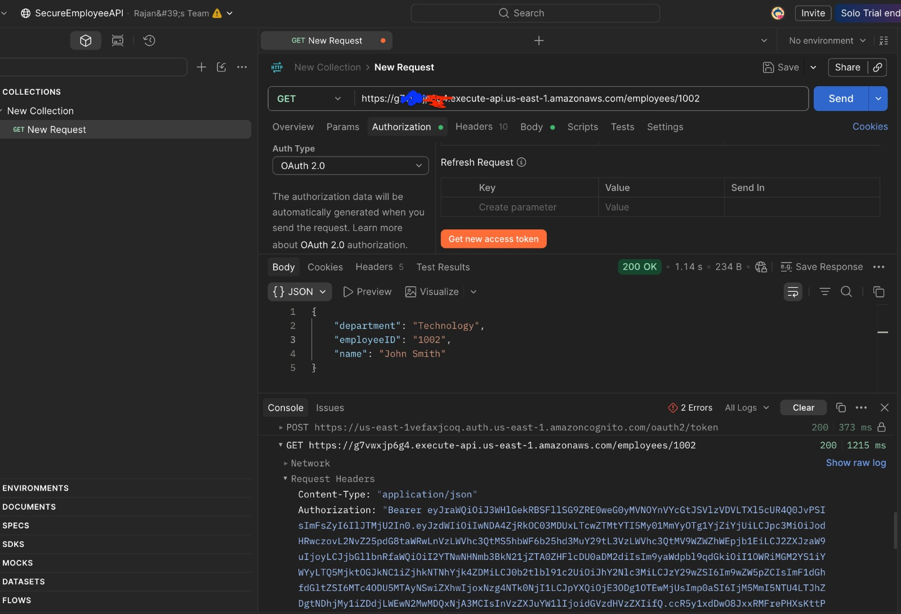
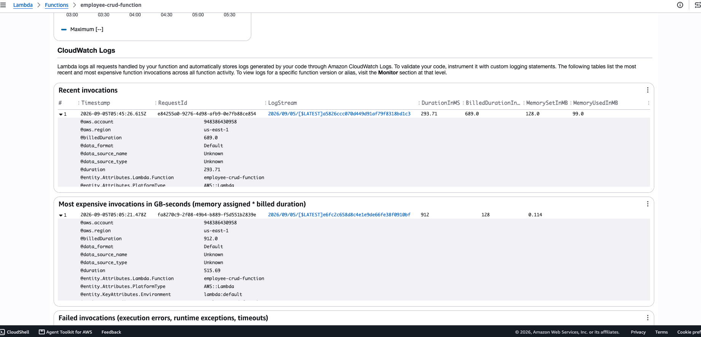

# 🔐 Secure Serverless CRUD API on AWS

This project demonstrates how to build and secure a simple serverless CRUD API using AWS services.

The API allows users to create, read, update, and delete employee records. Amazon Cognito is used for authentication, and API Gateway validates the user's JWT token before allowing access to the Lambda function.

## Architecture

```text
User / Postman
      |
      | Login
      v
Amazon Cognito
      |
      | JWT Token
      v
Amazon API Gateway
      |
      | Authorized Request
      v
AWS Lambda
      |
      v
Amazon DynamoDB

Lambda Logs
      |
      v
Amazon CloudWatch
```

## AWS Services Used

* Amazon API Gateway
* AWS Lambda
* Amazon DynamoDB
* Amazon Cognito
* AWS IAM
* Amazon CloudWatch

## API Operations

| Method | Endpoint                  | Description        |
| ------ | ------------------------- | ------------------ |
| POST   | `/employees`              | Create an employee |
| GET    | `/employees/{employeeId}` | Get an employee    |
| PUT    | `/employees/{employeeId}` | Update an employee |
| DELETE | `/employees/{employeeId}` | Delete an employee |

## Example Employee

```json
{
  "employeeID": "1001",
  "name": "John Smith",
  "department": "Technology"
}
```

## Security

### Cognito Authentication

Amazon Cognito is used to authenticate users.

API Gateway uses a JWT authorizer to validate the token before invoking the Lambda function.

Without authentication:

```text
GET /employees/1001
→ 401 Unauthorized
```

With a valid Cognito token:

```text
GET /employees/1001
→ 200 OK
```

### Least-Privilege IAM

The Lambda function does not have full DynamoDB access.

Its IAM role only allows the required CRUD operations on the `employee` DynamoDB table:

* `dynamodb:GetItem`
* `dynamodb:PutItem`
* `dynamodb:UpdateItem`
* `dynamodb:DeleteItem`

## Testing

The API was tested using Postman.

Testing included:

* Creating an employee
* Reading an employee
* Updating an employee
* Deleting an employee
* Accessing the API without authentication
* Accessing the API with a valid Cognito token

## Screenshots

### API Gateway Routes



### DynamoDB



### Lambda



### Cognito



### Unauthorized Request

The API rejects requests without a valid authentication token.



### Authorized Request

A request with a valid Cognito token is successfully processed.



### CloudWatch Logs



## What I Learned

Through this project, I learned how to:

* Build a REST API using Amazon API Gateway
* Run serverless application logic using AWS Lambda
* Store data using DynamoDB
* Implement authentication using Amazon Cognito
* Protect API endpoints using JWT authorization
* Apply least-privilege IAM permissions
* Test REST APIs using Postman
* Monitor Lambda executions using CloudWatch

## Future Improvements

Possible future enhancements include:

* AWS WAF
* API throttling and rate limiting
* Request validation
* Infrastructure as Code using AWS SAM or CloudFormation
* CORS configuration
* Automated deployment
